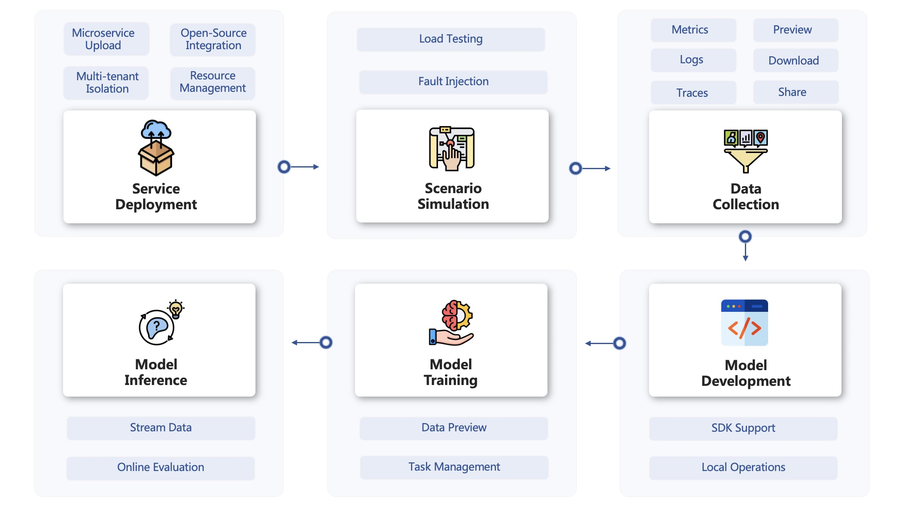

# MicroOps

:star2:Platform Website: https://aiops-nirc.bupt.site

<b>Providing end-to-end automation support for AIOps model development in microservice scenarios</b> 

MicroOps offers a secure and independent microservices environment with outstanding fault orchestration capabilities, allowing you to flexibly generate datasets of various scales and types. You can also efficiently integrate models with platform data, and MicroOps will assist you in model training and validation.
